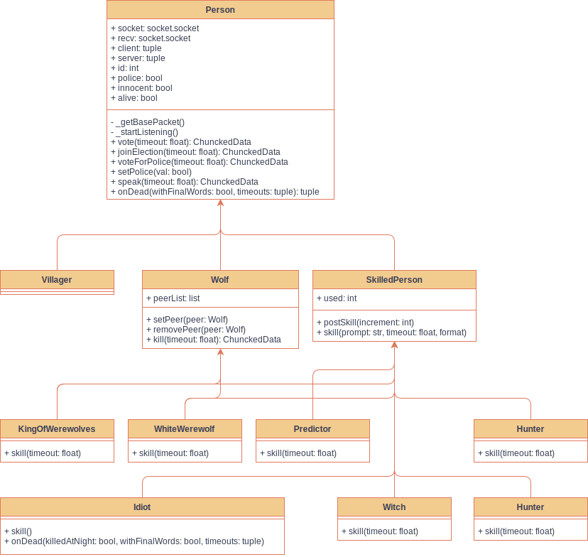

# Werewolf

The final project of Computer Network in 2020A, written in Python.

## Weekly Report Summary

**Progress To-do List:**

* [x] Protocol implementation
* [ ] Player identity abstraction
* [ ] Server side interface implementation
* [ ] Client side interface implementation
* [ ] Graphics user interface implementation

**Meeting Summary:**

* 2020/10/12
  * **IMPORTANT** Prerequisite: Implement a application layer protocol.  
    * Possible reference `urllib` or `requests`
    * The program sends and receives chuncked data rather than the plain text (raw data).
  * Function Demand: Implement the werewolf game rule (at most 12 players)
  * Tasks
    * Collect the game rule and demo applications;
    * Collect demo implementations.
* 2020/10/16
  * Recent progress report
  * Implementation framework
    * Protocol
    * Player's identity
    * Server interface & CLI server
    * Client interface
    * GUI
* 2020/10/25
  * Recent progress report
  * Player's identity layer (Finished in [abstraction.py](Werewolf/abstraction.py), **code review in progress**)
  * Starting the implementation of the server side after the code review
  * Starting the implementation of the client side after the code review

### From 2020/10/12

Function Demand: Gamerule, which is listed in [docs](docs/docs/gamerule.md).

Demo implementation:

* [https://github.com/GeminiLab/OOPLRS](https://github.com/GeminiLab/OOPLRS) (C++ & Qt)
* [https://github.com/Terund/Werewolf](https://github.com/Terund/Werewolf) (Python, not fully implemented)

Protocol implementation: Please refer to its [introduction](Werewolf/WP/README.md) page

### From 2020/10/16

**Function Demand: Player's identity**

All players in the game are summarized in a abstract class `Person` which provides the following attributes and methods.

* Attribute: `client`, a `socket.socket` object, which is the sending socket to send packets.
* Attribute: `id`, the sequential identification number of the player, or the seat the player has taken.
* Method: `vote()`, `joinElection()`, `voteForPolice()` and `speak()` method.
* Attribute: `police`, whether the player is the police officer. **Notice that there is at most one police officer in a game.**
* Whether the individual is innocent or evil.

`Villager` is the subclass of `Person`, corresponds to the villager identity in the game. This subclass does not have any more attributes or methods.

`Wolf` is the subclass of `Person`, corresponds to all the evil identities in the game, including werewolves, King of Werewolves, and the White Werewolf. The latter two is the subclass of `Wolf`. The `Wolf` class include the following attributes and methods:

* Method: `kill()`, werewolves need to kill a person at night. 
* Method: `destruct()`, a werewolf reveals its identity and it turns night immediately.

`SkilledPerson` is the abstract subclass of `Person`, corresponds to the skilled villager identity in the game, including `Predictor`, `Witch`, `Hunter`, `Guard` and `Idiot`. The specific identity should be implemented in the subclass

* Method: `skill()`, method for a player to use his skill.

It should be noticed that the all the method mentioned above are **based on the protocol** and sends a packet to the client when the method is called. These methods return the action status of the play. For werewolves, for example, `kill()` method should return a number indicating the person to be killed and `destruct()` method should return a boolean value indicating whether the werewolf want to reveal its identity.

This layer is implemented on 2020/10/24, in [abstraction.py](Werewolf/abstraction.py)

**Function Demand: Server interface**

The server should control the game progress, and inform each player's action.

**Task: GUI design**

PyQt5 is used to design and implement the GUI. A prototype will be needed.

### From 2020/10/25

**Code Review Result of [abstraction.py](Werewolf/abstraction.py)**

The original file is modified to meet the function demand. Refer to the annotation in the file to get more information about the structure of the classes. UML graph is shown below:

**Implementation of server side**

TODO: Report the progress here.

**Implementation of client side**

TODO: Report the progress here.

<!-- 所有的人抽象成基类，所需的属性与方法如下：

1. 编号属性
2. 投票、上警和发言方法
3. 警长属性
4. 是否好人属性

村民属于子类，神和狼属于另一个子类

村民子类不需要额外的功能

神和狼作为一个类， 1定义一个虚函数表示他们可以执行的操作，加一个执行条件

具体实现： -->
