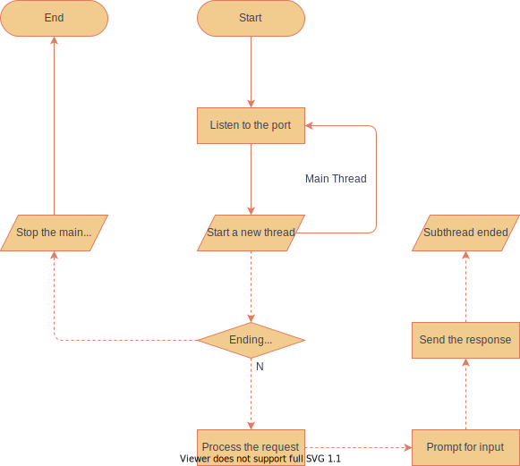

# Werewolf

The final project of Computer Network in 2020A, written in Python.

## Weekly Report Summary

**Progress To-do List:**

* [x] Protocol implementation
* [x] Player identity abstraction
* [x] Server side interface implementation
* [ ] Client side interface implementation
* [ ] Graphics user interface implementation (**depreciated**)

**Meeting Summary:**

* 2020/10/12
  * **IMPORTANT** Prerequisite: Implement a application layer protocol.  
    * Possible reference `urllib` or `requests`
    * The program sends and receives chunked data rather than the plain text (raw data).
  * Function Demand: Implement the werewolf game rule (at most 12 players)
  * Tasks
    * Collect the game rule and demo applications;
    * Collect demo implementations.
* 2020/10/16
  * Recent progress report
  * Implementation framework
    * Protocol
    * Player's identity
    * Server interface & CLI server
    * Client interface
    * GUI
* 2020/10/25
  * Recent progress report
  * Player's identity layer (Finished in [abstraction.py](Werewolf/abstraction.py), **code review finished**)
  * Starting the implementation of the server side after the code review
  * Starting the implementation of the client side after the code review
* 2020/10/31
  * Recent progress report
  * Discussed the framework of the server and server side
  * Detailed implementation of client and server side should be progressed
* 2020/11/08
  * Recent progress report
  * Discussed the detailed implementation of the client side and the usage of the Protocol
  * Discussed the interface (packets used) between the client side and the server side.
* 2020/11/15
  * Recent progress report
  * Resolve issues
  * Discussed on the communication between the client and the server ([server发送的包](https://github.com/HuangFuSL/Werewolf/issues/17)).

### 2020/10/12

Function Demand: Gamerule, which is listed in [docs](docs/docs/gamerule.md).

Demo implementation:

* [https://github.com/GeminiLab/OOPLRS](https://github.com/GeminiLab/OOPLRS) (C++ & Qt)
* [https://github.com/Terund/Werewolf](https://github.com/Terund/Werewolf) (Python, not fully implemented)

Protocol implementation: Please refer to its [introduction](Werewolf/WP/README.md) page

### 2020/10/16

**Function Demand: Player's identity**

All players in the game are summarized in a abstract class `Person` which provides the following attributes and methods.

* Attribute: `client`, a `socket.socket` object, which is the sending socket to send packets.
* Attribute: `id`, the sequential identification number of the player, or the seat the player has taken.
* Method: `vote()`, `joinElection()`, `voteForPolice()` and `speak()` method.
* Attribute: `police`, whether the player is the police officer. **Notice that there is at most one police officer in a game.**
* Whether the individual is innocent or evil.

`Villager` is the subclass of `Person`, corresponds to the villager identity in the game. This subclass does not have any more attributes or methods.

`Wolf` is the subclass of `Person`, corresponds to all the evil identities in the game, including werewolves, King of Werewolves, and the White Werewolf. The latter two is the subclass of `Wolf`. The `Wolf` class include the following attributes and methods:

* Method: `kill()`, werewolves need to kill a person at night. 
* Method: `destruct()`, a werewolf reveals its identity and it turns night immediately.

`SkilledPerson` is the abstract subclass of `Person`, corresponds to the skilled villager identity in the game, including `Predictor`, `Witch`, `Hunter`, `Guard` and `Idiot`. The specific identity should be implemented in the subclass

* Method: `skill()`, method for a player to use his skill.

It should be noticed that the all the method mentioned above are **based on the protocol** and sends a packet to the client when the method is called. These methods return the action status of the play. For werewolves, for example, `kill()` method should return a number indicating the person to be killed and `destruct()` method should return a boolean value indicating whether the werewolf want to reveal its identity.

This layer is implemented on 2020/10/24, in [abstraction.py](Werewolf/abstraction.py)

**Function Demand: Server interface**

The server should control the game progress, and inform each player's action.

**Task: GUI design**

PyQt5 is used to design and implement the GUI. A prototype will be needed.

### 2020/10/25

**Code Review Result of [abstraction.py](Werewolf/abstraction.py)**

The original file is modified to meet the function demand. Refer to the annotation in the file to get more information about the structure of the classes. UML graph is shown below:

**Implementation of server side**

**Implementation of client side**

### 2020/10/31

**Implementation of server side**

The server plays a role as the God in the werewolf game, most game rules are carried out by the server and it follows the implementation logic like the following:

* Threads: we use the parent thread to carry out most game rules, and the child threads responsible for the clients where one child thread corresponds to one client(player). The child threads can communicate with the parent thread.
* Parent thread: it carry out most functions of the God in the werewolf game. It control the procedure of the game. In the night, it exchange information with the corresponding wolf or god person. In the day, it shows the discussion on the board and calculates the voting result. The server exchange information with each client through each corresponding child thread.
* Child thread: it carry out the function to exchange information with the client directly. It listen and get the information from the client and decide whether to deliver it to the parent thread or not.

**Implementation of client side**

* Threads: we use the parent thread responsible for listening, and the child threads responsible for input.
* Parent thread: it carry out the function of listening. It listen to the corresponding parent thread of the server. When the client want to input, it will create a new child thread.
* Child thread: it carry out the function of user input. 

### 2020/11/08

**Implementation of server side**

The code is committed to [server.py](Werewolf/server.py) and [logic.py](Werewolf/server/logic.py)

**Currently pending for further implementation and code review!**

**Implementation of client side**

Discussed implementation of the special ability of wolves (狼人自爆). The consensus was that this ability is triggered by Ctrl-C. Python will raise an `KeyboardInterrupt` exception to break out from the ongoing thread. The client use `try-except` to catch this input and start processing.

The current code is committed to [client_subthread.py](Werewolf/client_subthread.py). This file is not designed to be a standalone Python script file. It is to be checked and modulized.

**Currently pending for further implementation and code review!**

### 2020/11/15

**Implementation of server side**

The code is committed to [server.py](Werewolf/server.py) and [logic.py](Werewolf/server/logic.py). For code review please refer to the following commits:

* [https://github.com/HuangFuSL/Werewolf/tree/d3d3d5396759682fdd99e7a83a7d83ecb621cd33](d3d3d53), finished the election 
* [https://github.com/HuangFuSL/Werewolf/tree/3b1c7c25f2227804fc319040944ef3aca2f49d2b](3b1c7c2), partly finished game logic during the night
* [https://github.com/HuangFuSL/Werewolf/tree/6778dab034fe7b9d437c1563f287b041dae2e099](6778dab), finished game logic during the night
* [https://github.com/HuangFuSL/Werewolf/tree/49c3218098d1e87be3cd1eb97d4ec35a81bde9d5](49c3218), server side has completed

Issues during the development:

* (Resolved) [关于server.py及logic.py文件](https://github.com/HuangFuSL/Werewolf/issues/11)
* [已经完成Server部分的夜间流程](https://github.com/HuangFuSL/Werewolf/issues/15)

Currently pending for code review, static syntax check and joint debug with the client.

**Implementation of client side**

Progressed the implementation of the client side. Existing code is merged into [client.py](Werewolf/client.py), and pending for code review. Please refer to [history commits](https://github.com/HuangFuSL/Werewolf/commits/main) for more information.

Issues during the development:

* (Resolved) [关于client.py文件](https://github.com/HuangFuSL/Werewolf/issues/10)
* (Resolved) [关于client_subthread.py文件](https://github.com/HuangFuSL/Werewolf/issues/9)

<!-- 所有的人抽象成基类，所需的属性与方法如下：

1. 编号属性
2. 投票、上警和发言方法
3. 警长属性
4. 是否好人属性

村民属于子类，神和狼属于另一个子类

村民子类不需要额外的功能

神和狼作为一个类， 1定义一个虚函数表示他们可以执行的操作，加一个执行条件

具体实现： -->
